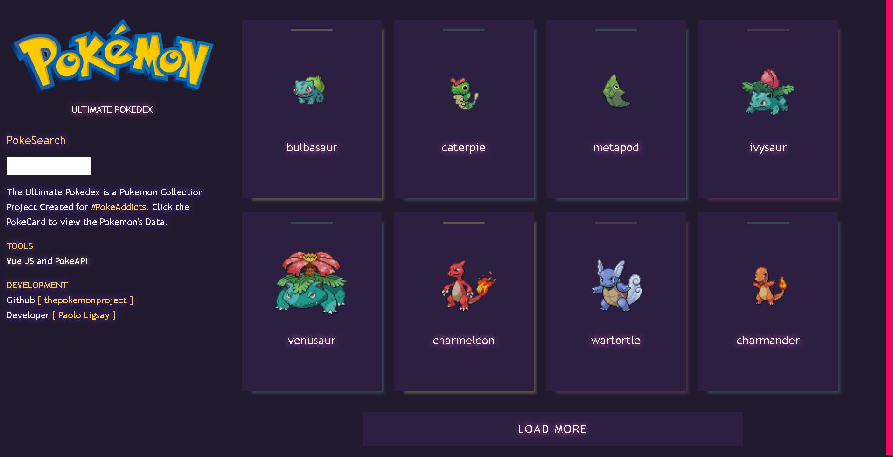

# The Ultimate Pokedex 
The Ultimate Pokedex is a Pokemon Collection Project Created for #PokeAddicts. This Project is created with VUE JS and PokeAPI. Please leave a star if you liked it! 



## This Project is created for People who:
* [ Pokemon Lover ] - people who loves Pokemon 
* [ Developer ] - people who likes to study or play with Vue JS and APIs 

## Author
* Paolo Ligsay
 
### Compiles and hot-reloads for development
```
npm run serve
```

### Compiles and minifies for production
```
npm run build
```

### Lints and fixes files
```
npm run lint
```

### Styling
Styles are created at the scss folder
* anim.scss - for animations
* mixin.scss - for includes and mixins
* main.scss - main styling of the project ( global )

## License

You are FREE to use, recreate, distribute anything in this project. You are free to modify the code in any ways you want, you can use parts of the code and apply it in your own work, but please give credit because I invest my time, energy and knowledge to develop this project. Thank you! 

### Ways to give credit

* add a link/image link to this repo
* creaditing the author of the project [ https://thecreativesdaily.com/paololigsay/ ]
